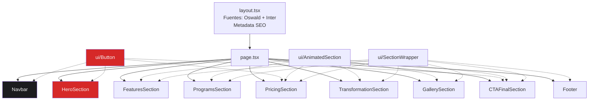

# Documento de Diseño: Premium Gym Landing Page

## Visión General

Landing page de una sola página para un gimnasio premium, construida con Next.js 14+ (App Router), Tailwind CSS, Framer Motion, next/image y Lucide React. La arquitectura sigue un enfoque de componentes modulares donde cada sección de la página es un componente independiente compuesto dentro de un layout principal. El diseño prioriza rendimiento (lazy loading, optimización de imágenes), accesibilidad (contraste 4.5:1, áreas de toque 44x44px) y una experiencia visual premium con animaciones controladas.

La página se compone de 9 secciones verticales: Navbar, Hero, Features, Programs, Pricing, Transformation, Gallery, CTA Final y Footer. Cada sección es un Server Component por defecto, con Client Components solo donde se requiere interactividad (animaciones, scroll, menú móvil).

## Arquitectura

### Estructura del Proyecto

```
src/
├── app/
│   ├── layout.tsx          # Root layout (fuentes Oswald + Inter, metadata)
│   ├── page.tsx             # Página principal que compone todas las secciones
│   └── globals.css          # Estilos globales y configuración Tailwind
├── components/
│   ├── ui/
│   │   ├── Button.tsx       # Botón reutilizable (CTA primary, outline)
│   │   ├── SectionWrapper.tsx # Wrapper con padding y max-width consistente
│   │   └── AnimatedSection.tsx # Wrapper Framer Motion para animaciones de entrada
│   ├── Navbar.tsx           # Barra de navegación fija
│   ├── HeroSection.tsx      # Sección hero full-viewport
│   ├── FeaturesSection.tsx  # Sección de beneficios con tarjetas
│   ├── ProgramsSection.tsx  # Sección de programas de entrenamiento
│   ├── PricingSection.tsx   # Sección de planes de membresía
│   ├── TransformationSection.tsx # Sección de testimonios
│   ├── GallerySection.tsx   # Galería de imágenes
│   ├── CTAFinalSection.tsx  # Sección CTA de cierre
│   └── Footer.tsx           # Pie de página
├── lib/
│   └── data.ts              # Datos estáticos (features, programs, pricing, testimonials)
└── types/
    └── index.ts             # Tipos TypeScript compartidos
```

### Diagrama de Componentes



### Decisiones de Arquitectura

| Decisión | Elección | Justificación |
|----------|----------|---------------|
| Renderizado | Server Components por defecto, Client Components para interactividad | Minimiza JS en el cliente, mejor rendimiento |
| Datos | Archivo estático `data.ts` | No hay backend; datos hardcoded para landing page |
| Animaciones | Framer Motion con `useInView` | Control preciso de animaciones de entrada, activación única |
| Imágenes | next/image con lazy loading | Optimización automática, formatos modernos (WebP/AVIF) |
| Responsive | Tailwind breakpoints mobile-first | Consistente con el enfoque mobile-first del requisito |
| Fuentes | next/font/google (Oswald + Inter) | Optimización automática, sin layout shift |

## Componentes e Interfaces

### Componentes UI Base

#### Button
```typescript
interface ButtonProps {
  children: React.ReactNode;
  variant: 'primary' | 'outline';
  href?: string;
  fullWidth?: boolean;
  className?: string;
}
```
- `primary`: fondo `#D62828`, hover `#9E1B1B`, texto blanco
- `outline`: borde `#D62828`, fondo transparente, hover fondo `#D62828`
- Área de toque mínima 44x44px

#### SectionWrapper
```typescript
interface SectionWrapperProps {
  children: React.ReactNode;
  id?: string;
  className?: string;
  background?: 'default' | 'card';
}
```
- Aplica `max-w-7xl mx-auto`, padding horizontal 16px (mobile) / 32px (desktop)
- `default`: fondo `#0F0F10`, `card`: fondo `#1C1C1F`

#### AnimatedSection
```typescript
interface AnimatedSectionProps {
  children: React.ReactNode;
  animation?: 'fadeUp' | 'fadeIn' | 'slideLeft' | 'slideRight';
  delay?: number;
  stagger?: boolean;
  staggerDelay?: number; // 0.1 - 0.2s
}
```
- Usa `useInView` con `once: true` para activar animación una sola vez
- Duración máxima 0.8s
- Client Component (`"use client"`)

### Componentes de Sección

#### Navbar
- **Tipo**: Client Component (scroll listener, menú móvil)
- **Estado**: `isScrolled` (boolean, scroll > 50px), `isMobileMenuOpen` (boolean)
- **Comportamiento**: Fijo en top, fondo transparente → semi-transparente con blur al scroll
- **Mobile**: Menú hamburguesa con Lucide `Menu`/`X` icons
- **Scroll suave**: `scrollIntoView({ behavior: 'smooth' })` en enlaces

#### HeroSection
- **Tipo**: Client Component (animaciones de entrada)
- **Imagen**: next/image con `fill`, `priority`, `object-cover`
- **Overlay**: `bg-black/60` (60% opacidad mínima)
- **Animación**: Headline fade-in desde abajo (0.8s), subtítulo y CTA secuencial (delay 0.2s, 0.4s)
- **Tipografía**: Headline Oswald uppercase ≥48px desktop, ≥32px mobile

#### FeaturesSection
- **Tipo**: Client Component (animaciones stagger)
- **Grid**: 1 col (mobile) → 2 col (tablet) → 4 col (desktop)
- **Tarjetas**: Fondo `#1C1C1F`, icono Lucide, título Oswald uppercase, descripción Inter
- **Hover**: `scale(1.02)`, borde `#D62828` sutil, sombra elevada
- **Iconos**: `Dumbbell`, `Heart`, `Users`, `Trophy` de Lucide React

#### ProgramsSection
- **Tipo**: Client Component (animaciones, hover overlay)
- **Grid**: 1 col (mobile) → 2 col (desktop)
- **Tarjetas**: Imagen de fondo con next/image, overlay gradiente, nombre + descripción
- **Hover**: `scale(1.05)`, overlay con información adicional visible
- **Programas**: Fuerza, Cross Training, Funcional, HIIT

#### PricingSection
- **Tipo**: Client Component (animaciones stagger)
- **Grid**: 1 col (mobile, Pro primero) → 3 col (desktop)
- **Plan Pro**: Badge "Más Popular" color `#FF6B00`, borde diferenciado, botón primary
- **Otros planes**: Botón outline
- **Características**: Lista con icono `Check` de Lucide en color `#D62828`
- **Hover**: Elevación y cambio de borde

#### TransformationSection
- **Tipo**: Client Component (animaciones fade-in)
- **Grid**: 1 col (mobile) → 3 col (desktop)
- **Testimonios**: Comillas estilizadas (`""`), nombre, resultado, valoración con estrellas
- **Tipografía**: Texto testimonio en Inter italic, nombre en Oswald

#### GallerySection
- **Tipo**: Client Component (animaciones fade-in)
- **Grid**: 1-2 col (mobile) → 3-4 col (desktop), estilo grid asimétrico con `row-span` variado
- **Imágenes**: next/image con lazy loading, `object-cover`
- **Hover**: `scale(1.1)` con `overflow-hidden` en contenedor, transición suave
- **Fuente**: Archivos `pexels-amar-*.jpg` del workspace

#### CTAFinalSection
- **Tipo**: Client Component (animaciones)
- **Fondo**: Imagen con overlay oscuro o gradiente radial desde `#D62828` a `#0F0F10`
- **Contenido**: Headline Oswald uppercase prominente, subtítulo, botón CTA primary
- **Animación**: Fade-in al entrar en viewport

#### Footer
- **Tipo**: Server Component (sin interactividad)
- **Grid**: 1 col centrada (mobile) → 3-4 col (desktop)
- **Contenido**: Logo, contacto (dirección, teléfono, email), enlaces secciones, redes sociales
- **Redes sociales**: Iconos Lucide (`Instagram`, `Facebook`, `Twitter`, `Youtube`)
- **Separación**: Borde superior `border-t border-white/10`

## Modelos de Datos

### Tipos TypeScript

```typescript
// types/index.ts

export interface Feature {
  icon: string;       // Nombre del icono Lucide (e.g., "Dumbbell")
  title: string;      // Título del beneficio
  description: string; // Descripción breve
}

export interface Program {
  name: string;        // Nombre del programa
  description: string; // Descripción breve
  image: string;       // Path a la imagen
}

export interface PricingPlan {
  name: string;           // "Básico" | "Pro" | "Elite"
  price: number;          // Precio mensual
  currency: string;       // "€" o "$"
  features: string[];     // Lista de características incluidas
  isPopular: boolean;     // true solo para Pro
  ctaText: string;        // Texto del botón
}

export interface Testimonial {
  name: string;           // Nombre del miembro
  text: string;           // Texto del testimonio
  result: string;         // Resultado logrado (e.g., "-15kg en 6 meses")
  rating: number;         // Valoración 1-5
}

export interface NavLink {
  label: string;          // Texto del enlace
  href: string;           // ID de la sección (e.g., "#features")
}
```

### Datos Estáticos (lib/data.ts)

Los datos se definen como constantes exportadas tipadas. No hay API ni base de datos — todos los datos son estáticos para la landing page.

```typescript
export const NAV_LINKS: NavLink[] = [
  { label: "Beneficios", href: "#features" },
  { label: "Programas", href: "#programs" },
  { label: "Precios", href: "#pricing" },
  { label: "Resultados", href: "#transformation" },
];

export const FEATURES: Feature[] = [/* 4 items */];
export const PROGRAMS: Program[] = [/* 4 items */];
export const PRICING_PLANS: PricingPlan[] = [/* 3 items */];
export const TESTIMONIALS: Testimonial[] = [/* 3+ items */];
```

## Manejo de Errores

### Imágenes
- next/image maneja errores de carga automáticamente con placeholder blur o fallback
- Las imágenes de la galería usan lazy loading; si una imagen falla, el espacio del grid se mantiene con un fondo `#1C1C1F`
- Se define un `onError` handler en las imágenes de la galería para mostrar un placeholder

### Navegación
- Los enlaces de scroll suave usan `document.getElementById()` con verificación null antes de llamar `scrollIntoView`
- Si una sección target no existe, el click no produce efecto (fail silently)

### Animaciones
- Framer Motion maneja gracefully los casos donde `IntersectionObserver` no está disponible (SSR)
- Las animaciones usan `once: true` para evitar re-triggers innecesarios
- Si Framer Motion falla en cargar, los componentes se renderizan sin animación (contenido visible)

### Responsive
- El diseño mobile-first garantiza que el contenido es accesible incluso si CSS personalizado falla
- Los breakpoints de Tailwind son progresivos: el layout base (mobile) siempre funciona

## Estrategia de Testing

### Por qué no se aplica Property-Based Testing

Esta feature es una landing page de UI pura — renderizado visual, layout, animaciones y diseño responsive. No contiene lógica de transformación de datos, parsers, serializers ni funciones puras con espacios de entrada amplios. Los componentes son principalmente declarativos (JSX + Tailwind) con datos estáticos hardcoded. Por estas razones, PBT no es apropiado para esta feature.

### Enfoque de Testing Recomendado

#### Tests Unitarios (Jest + React Testing Library)
- **Renderizado de componentes**: Verificar que cada sección renderiza correctamente con los datos esperados
- **Navbar**: Verificar que los enlaces de navegación se renderizan, que el botón CTA está presente
- **Pricing**: Verificar que el plan Pro tiene el badge "Más Popular", que los 3 planes se muestran
- **Features**: Verificar que las 4 tarjetas de beneficios se renderizan con iconos y títulos
- **Footer**: Verificar que la información de contacto y los iconos de redes sociales están presentes

#### Tests de Snapshot
- Capturar snapshots de cada componente de sección para detectar cambios visuales no intencionados
- Especialmente útil para verificar la estructura HTML y las clases de Tailwind

#### Tests de Integración
- **Scroll suave**: Verificar que hacer click en un enlace de navegación llama `scrollIntoView` en la sección correcta
- **Menú móvil**: Verificar que el toggle del menú hamburguesa muestra/oculta los enlaces
- **Scroll listener**: Verificar que el estado `isScrolled` cambia al hacer scroll > 50px

#### Tests Visuales / E2E (Opcional - Cypress o Playwright)
- Verificar responsive layout en breakpoints clave (375px, 768px, 1024px, 1440px)
- Verificar que las animaciones se activan al scroll
- Verificar contraste de colores y tamaños de fuente

#### Accesibilidad
- Verificar contraste 4.5:1 entre texto `#F5F5F5` y fondo `#0F0F10` (cumple WCAG AA)
- Verificar áreas de toque ≥ 44x44px en botones y enlaces
- Verificar que las imágenes tienen atributos `alt` descriptivos
- Verificar navegación por teclado en Navbar y menú móvil
